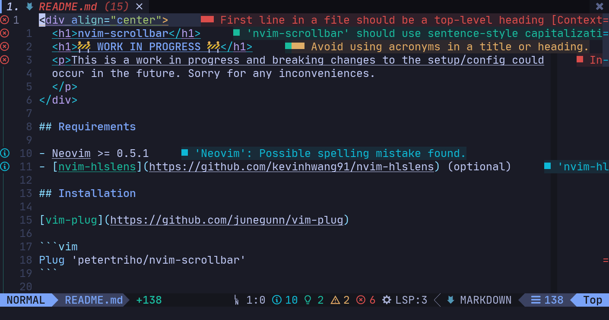
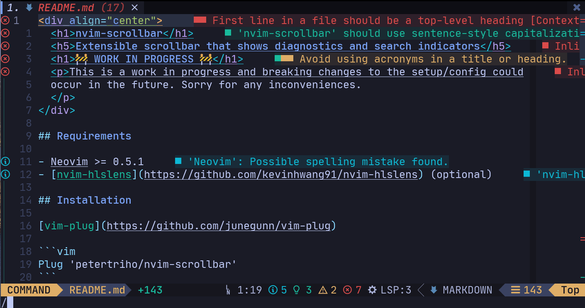

<div align="center">
  <h1>nvim-scrollbar</h1>
  <h5>Extensible Neovim Scrollbar</h5>
  <h1>🚧 WORK IN PROGRESS 🚧</h1>
  <p>This is a work in progress and breaking changes to the setup/config could
  occur in the future. Sorry for any inconveniences.
  </p>
</div>



## Features

- Diagnostics
- Search (requires [nvim-hlslens](https://github.com/kevinhwang91/nvim-hlslens))

## Requirements

- Neovim >= 0.5.1
- [nvim-hlslens](https://github.com/kevinhwang91/nvim-hlslens) (optional)

## Installation

[vim-plug](https://github.com/junegunn/vim-plug)

```vim
Plug 'petertriho/nvim-scrollbar'
```

[packer.nvim](https://github.com/wbthomason/packer.nvim)

```lua
use("petertriho/nvim-scrollbar")
```

## Setup

```lua
require("scrollbar").setup()

```

### Search



```lua
require("hlslens").setup({
    override_lens = function(render, plist, nearest, idx, r_idx)
      local sfw = vim.v.searchforward == 1
      local indicator, text, chunks
      local abs_r_idx = math.abs(r_idx)
      if abs_r_idx > 1 then
        indicator = ("%d%s"):format(abs_r_idx, sfw ~= (r_idx > 1) and "N" or "n")
      elseif abs_r_idx == 1 then
        indicator = sfw ~= (r_idx == 1) and "N" or "n"
      else
        indicator = ""
      end

      local lnum, col = unpack(plist[idx])
      if nearest then
        local cnt = #plist
      if indicator ~= "" then
        text = ("[%s %d/%d]"):format(indicator, idx, cnt)
      else
        text = ("[%d/%d]"):format(idx, cnt)
      end
        chunks = { { " ", "Ignore" }, { text, "HlSearchLensNear" } }
      else
        text = ("[%s %d]"):format(indicator, idx)
        chunks = { { " ", "Ignore" }, { text, "HlSearchLens" } }
      end
      render.set_virt(0, lnum - 1, col - 1, chunks, nearest)

      require("scrollbar").search_handler.show(plist)
    end,
})

vim.cmd([[
    augroup scrollbar_search_hide
    autocmd!
    autocmd CmdlineLeave : lua require('scrollbar').search_handler.hide()
    augroup END
]])
```

## Config

### Defaults

```lua
require("scrollbar").setup({
    handle = {
        text = " ",
        color = "white",
    },
    marks = {
        Search = { text = { "-", "=" }, priority = 0, color = "orange" },
        Error = { text = { "-", "=" }, priority = 1, color = "red" },
        Warn = { text = { "-", "=" }, priority = 2, color = "yellow" },
        Info = { text = { "-", "=" }, priority = 3, color = "blue" },
        Hint = { text = { "-", "=" }, priority = 4, color = "green" },
        Misc = { text = { "-", "=" }, priority = 5, color = "purple" },
    },
    excluded_filetypes = {
        "",
        "prompt",
        "TelescopePrompt",
    },
    autocmd = {
        render = {
            "BufWinEnter",
            "TabEnter",
            "TermEnter",
            "WinEnter",
            "CmdwinLeave",
            "TextChanged",
            "VimResized",
            "WinScrolled",
        },
    },
    handlers = {
        diagnostic = true,
        search = true,
    },
})
```

### Example config with [tokyonight.nvim](https://github.com/folke/tokyonight.nvim) colors

```lua
local colors = require("tokyonight.colors").setup()

require("scrollbar").setup({
    handle = {
        color = colors.bg_highlight,
    },
    marks = {
        Search = { color = colors.orange },
        Error = { color = colors.error },
        Warn = { color = colors.warning },
        Info = { color = colors.info },
        Hint = { color = colors.hint },
        Misc = { color = colors.purple },
    }
})
```

## License

[MIT](https://choosealicense.com/licenses/mit/)
